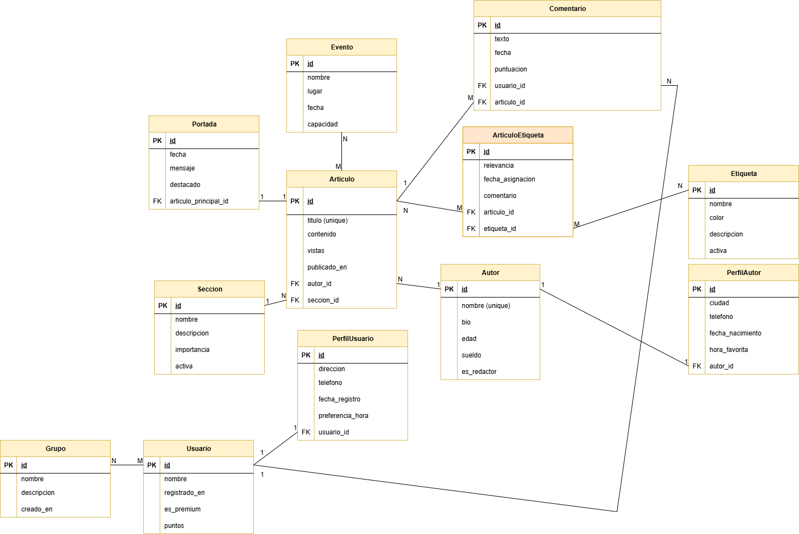

# Periódico - Documentación

Información sobre los modelos, con estructura de cada clase y explicacion de los parametros usados, además del diagrama entidad-relación.

## Descripción de los modelos

### Autor

- **nombre**: Texto, nombre completo, único.
- **bio**: Texto, biografía opcional.
- **edad**: Entero positivo, edad, opcional.
- **sueldo**: Decimal, sueldo mensual.
- **es_redactor**: Booleano, indica si es redactor, no editable.

### PerfilAutor

- **autor**: Relación uno a uno con Autor.
- **ciudad**: Texto opcional.
- **telefono**: Texto, solo números.
- **fecha_nacimiento**: Fecha opcional.
- **hora_favorita**: Hora, se actualiza automáticamente.

### Usuario

- **nombre**: Texto.
- **registrado_en**: Fecha y hora de registro automática.
- **es_premium**: Booleano para usuario premium.
- **puntos**: Entero, editable.

### PerfilUsuario

- **usuario**: Relación uno a uno con Usuario.
- **direccion**: Texto opcional.
- **telefono**: Texto opcional.
- **fecha_registro**: Fecha creación automática.
- **preferencia_hora**: Hora, automática.

### Seccion

- **nombre**: Texto con opciones: Política, Deportes, Cultura.
- **descripcion**: Texto opcional.
- **importancia**: Número entero.
- **activa**: Booleano.

### Articulo

- **titulo**: Texto único.
- **contenido**: Texto completo.
- **autor**: Relación muchos a uno con Autor.
- **seccion**: Relación muchos a uno con Seccion, opcional.
- **visitas**: Número positivo.
- **publicado_en**: Fecha y hora creación automática.

### Portada

- **articulo_principal**: Relación uno a uno con Articulo.
- **fecha**: Fecha creación automática.
- **mensaje**: Texto corto.
- **destacado**: Booleano.

### Etiqueta

- **nombre**: Texto opcional.
- **color**: Texto, color HTML.
- **descripcion**: Texto opcional.
- **activa**: Booleano.

### ArticuloEtiqueta (Tabla intermedia)

- **articulo**: Relación muchos a uno con Articulo.
- **etiqueta**: Relación muchos a uno con Etiqueta.
- **relevancia**: Número flotante.
- **fecha_asignacion**: Fecha opcional.
- **comentario**: Texto opcional.

### Evento

- **nombre**: Texto.
- **lugar**: Texto opcional.
- **fecha**: Fecha.
- **articulos**: Relación muchos a muchos con Articulo.
- **capacidad**: Número positivo.

### Grupo

- **nombre**: Texto.
- **descripcion**: Texto opcional.
- **usuarios**: Relación muchos a muchos con Usuario.
- **creado_en**: Fecha creación automática.

### Comentario

- **usuario**: Relación muchos a uno con Usuario.
- **articulo**: Relación muchos a uno con Articulo.
- **texto**: Texto opcional.
- **fecha**: Fecha y hora actualización automática.
- **puntuacion**: Número flotante.

---

## Parámetros usados en los campos

- **max_length**: Limita longitud de texto.
- **unique**: Garantiza valor único.
- **blank**: Permite campo vacío en formularios.
- **null**: Acepta valor NULL en base de datos.
- **default**: Valor por defecto.
- **help_text**: Texto de ayuda para formularios/admin.
- **editable**: Controla edición en admin.
- **choices**: Opciones limitadas para campo.
- **on_delete**: Acción al eliminar entidad relacionada.
- **auto_now_add** y **auto_now**: Actualizan fecha y hora automáticamente.

---

## Esquema Entidad-Relación

A continuación, se muestra el diseño del diagrama entidad-relación:

